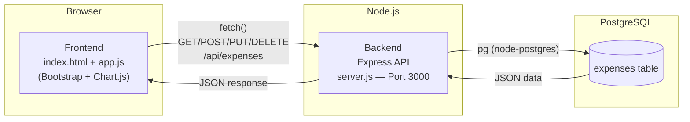
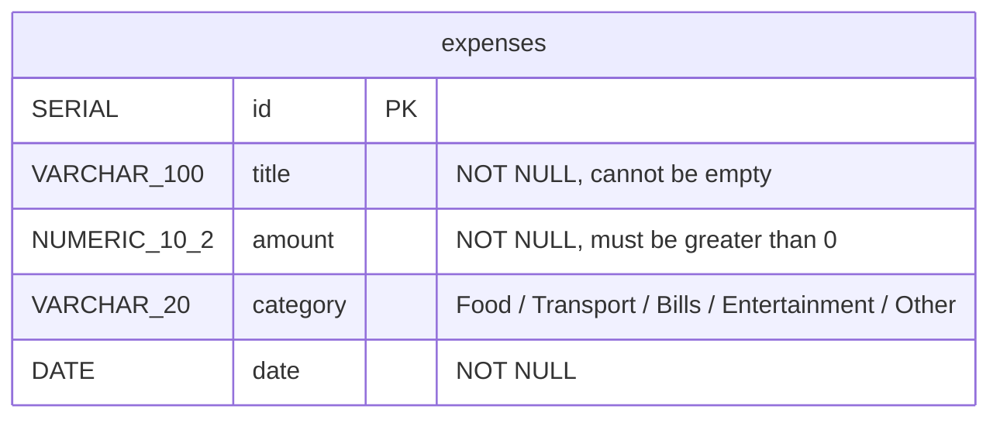
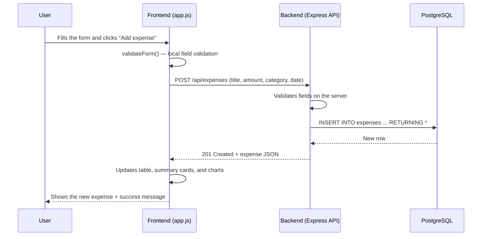

# Expense Tracker

A simple web app for tracking expenses: add an expense (title, amount, category, date), edit or delete it, and see a summary plus charts of your spending by category and by month. The frontend is plain HTML/CSS/JS, and the backend is an Express.js API connected to a PostgreSQL database.

## Project architecture



## Database schema (ERD)



## Request flow: adding an expense



## Prerequisites

- Node.js (any recent version, with npm)
- PostgreSQL installed and running on your machine
- VS Code (or any editor you prefer)

## How to run the project from scratch

### 1. Create the database

Open a terminal and log into PostgreSQL:

```bash
psql -U postgres
```

Then create a new database (rename it if you want):

```sql
CREATE DATABASE expense_tracker;
\q
```

### 2. Run schema.sql

From the project's root folder:

```bash
psql -U postgres -d expense_tracker -f backend/schema.sql
```

This creates the `expenses` table and inserts some sample data. **Note:** running this file again drops the existing table and recreates it with the same sample data.

### 3. Write the .env file

Inside the `backend/` folder, create a file named `.env` with your database connection details:

```env
DB_USER=postgres
DB_HOST=localhost
DB_NAME=expense_tracker
DB_PASSWORD=your_postgres_password
DB_PORT=5432
```

> Adjust `DB_PASSWORD` and the other values to match your local PostgreSQL setup.

### 4. Install the packages

From inside the `backend/` folder:

```bash
cd backend
npm install
```

### 5. Start the server (Backend)

Still inside `backend/`:

```bash
npm start
```

If it starts correctly you'll see in the terminal:

```
Server is running on http://localhost:3000
```

### 6. Open the frontend

Open `frontend/index.html` directly in your browser (double-click it), or use the Live Server extension in VS Code. Since `cors` is enabled on the backend, the frontend can talk to `http://localhost:3000` without any issues.

## Features

- [x] Add an expense (with validation on both frontend and backend)
- [x] Delete an expense (with a confirmation dialog)
- [x] Edit an expense (edit modal)
- [x] Filter by category, month, and search by title
- [x] Sort the table by any column (Title, Amount, Category, Date)
- [x] Summary cards (total, count, highest expense)
- [x] Charts: spending by category, and spending over time
- [x] Export expenses as a CSV file
- [x] Dark mode
- [x] Data is saved in a PostgreSQL database

## Screenshots

**Home page — light mode (desktop)**


**Home page — dark mode (desktop)**


**Mobile view — dark mode**


