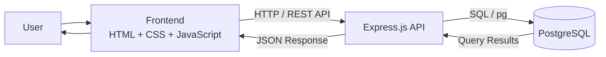
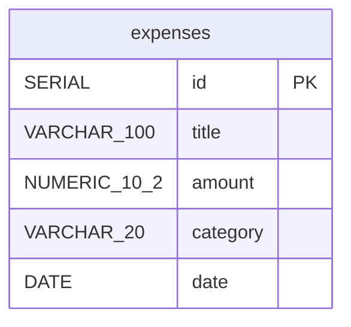
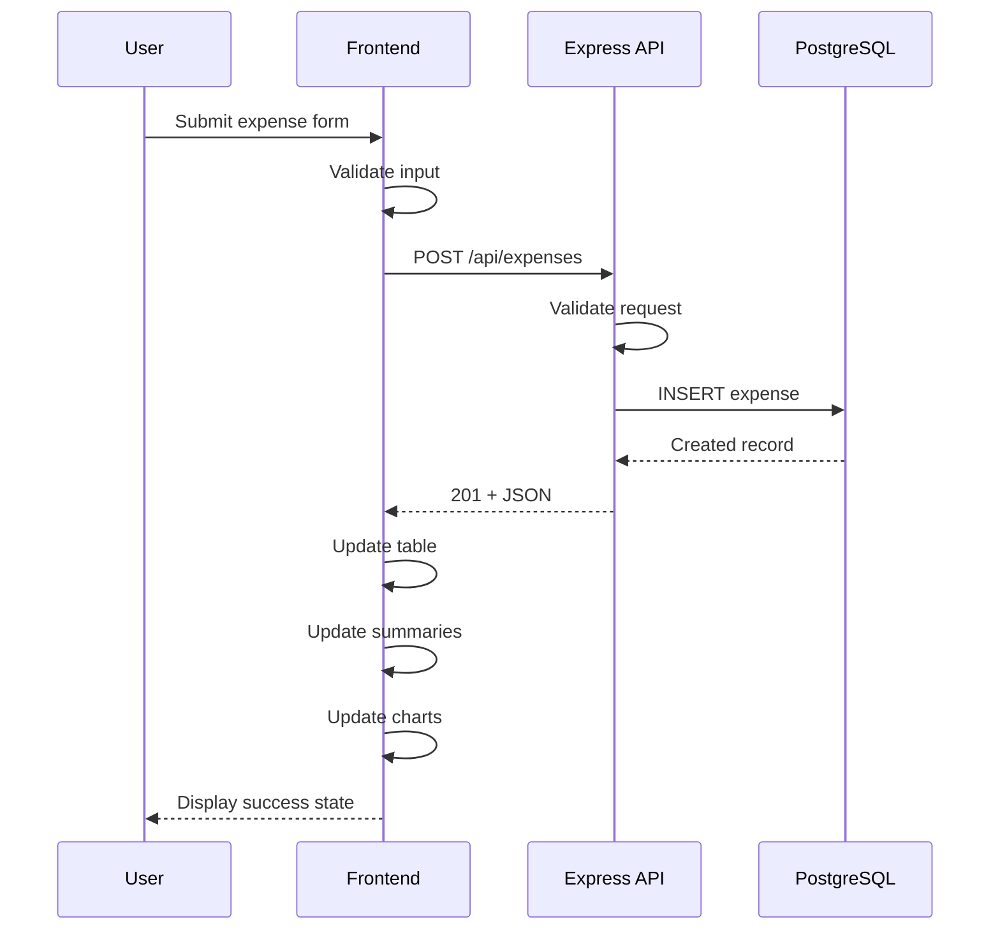
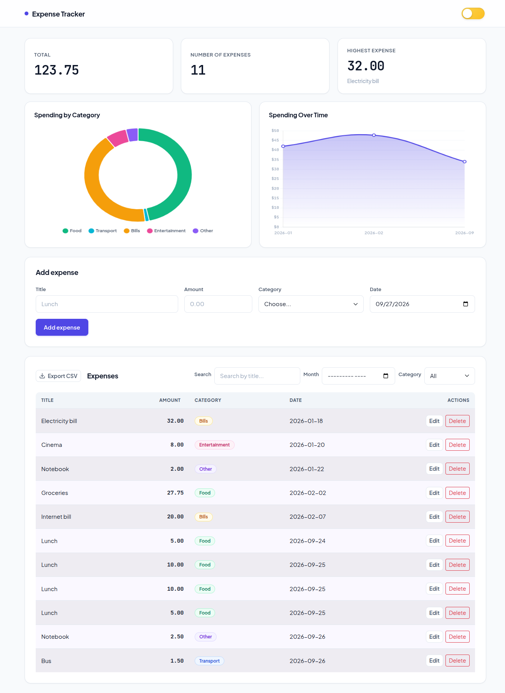
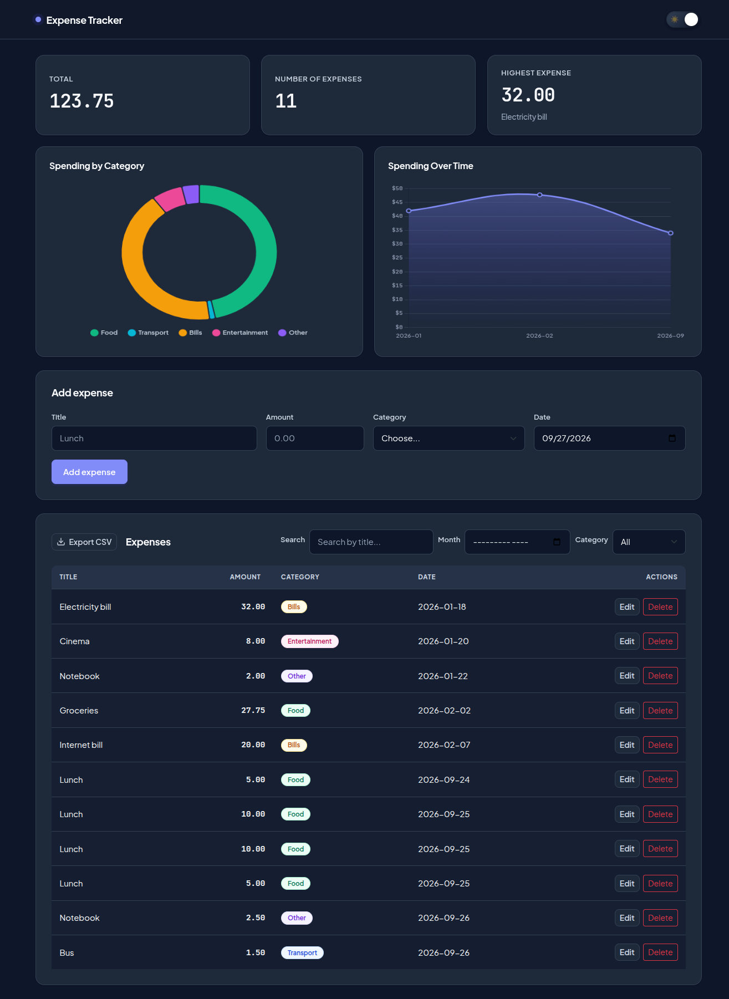
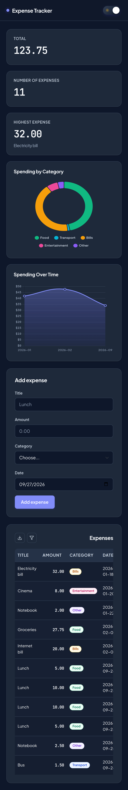

# Expense Tracker

A full-stack web application for managing, analyzing, and organizing personal expenses.

The application provides a responsive interface for creating, editing, deleting, filtering, sorting, and exporting expenses. It also includes spending summaries, interactive charts, and light/dark themes.

Built with **HTML, CSS, JavaScript, Bootstrap, Node.js, Express.js, and PostgreSQL**.

---

## Overview

Expense Tracker is designed as a practical full-stack application that connects a responsive frontend to a RESTful backend API and a PostgreSQL database.

Users can:

* Create and manage expenses
* Validate expense data on both client and server
* Filter and sort expenses
* Analyze spending through summary cards and charts
* Export expense data as CSV
* Switch between light and dark themes
* Use the application comfortably across desktop and mobile devices

---

## Features

### Expense Management

* Add new expenses
* Edit existing expenses
* Delete expenses with confirmation
* View all stored expenses
* Automatic database persistence

### Validation

* Client-side form validation
* Server-side validation
* Positive amount validation
* Title length validation
* Category validation
* Date format validation
* Invalid ID handling
* Proper HTTP status codes and error responses

### Filtering & Sorting

* Search expenses by title
* Filter by month
* Filter by category
* Sort by:

  * Title
  * Amount
  * Category
  * Date

### Dashboard & Analytics

* Total spending
* Number of expenses
* Highest expense
* Spending by category
* Spending over time

Charts are rendered dynamically using **Chart.js**.

### Data Export

* Export expenses to CSV
* Automatically generated CSV filename based on the current date
* Exported data respects the currently displayed expense list

### UI & Responsive Design

* Responsive desktop and mobile layouts
* Bootstrap-based components and utilities
* Custom application styling
* Light/Dark mode
* Responsive expense management section
* Mobile-specific filter interaction
* Accessible form controls and feedback messages

---

## Recent Updates

### Mobile Expenses UI Improvements

The Expenses section has been redesigned for smaller screens to improve usability, reduce visual clutter, and make the available actions easier to access.

#### Collapsible Mobile Filters

Search, Month, and Category filters are now hidden by default on small screens.

A dedicated filter button allows users to expand and collapse the filters when needed, keeping the Expenses section compact while preserving all filtering functionality.

#### Compact Mobile Actions

The **Export CSV** and filter controls now use compact square icon buttons on mobile.

* Export CSV uses a download icon
* Filter toggle uses a funnel icon
* Both controls share the same dimensions and visual treatment
* The full **Export CSV** text remains visible on desktop screens

#### Bootstrap Display Conflict Fix

Removed the Bootstrap `d-flex` utility class from the filters container.

The utility class applies `display: flex !important`, which conflicted with the custom mobile rule responsible for hiding the filter panel.

Removing the conflicting utility allows the responsive CSS to control the filter panel correctly.

#### Consistent Mobile Filter Layout

Mobile filter controls were updated so that:

* Labels appear above their controls
* Search, Month, and Category fields use the same width
* All controls align consistently
* The filter section uses the available mobile width more effectively

#### Improved Interaction States

The Export CSV and filter buttons now use the application's `--brand-primary` color for hover and active states.

The filter toggle remains highlighted while the filter panel is open, providing a clear visual indication of its current state.

---

## Tech Stack

### Frontend

| Technology  | Purpose                                 |
| ----------- | --------------------------------------- |
| HTML5       | Application structure                   |
| CSS3        | Custom styling and responsive design    |
| JavaScript  | Application logic and API communication |
| Bootstrap 5 | Responsive layout and UI utilities      |
| Chart.js    | Data visualization                      |
| SVG         | Interface icons                         |

### Backend

| Technology           | Purpose                        |
| -------------------- | ------------------------------ |
| Node.js              | JavaScript runtime             |
| Express.js           | REST API                       |
| PostgreSQL           | Relational database            |
| node-postgres (`pg`) | PostgreSQL database connection |
| CORS                 | Cross-origin communication     |
| dotenv               | Environment configuration      |

---

## Architecture

The application follows a simple three-layer architecture:



### Application Flow

```text
User
  │
  ▼
Frontend
HTML / CSS / JavaScript
  │
  │ fetch()
  ▼
Express.js REST API
  │
  │ node-postgres
  ▼
PostgreSQL
  │
  ▼
JSON Response
  │
  ▼
Frontend UI
```

---

## REST API

The backend exposes the following endpoints:

| Method   | Endpoint            | Description                 |
| -------- | ------------------- | --------------------------- |
| `GET`    | `/api/expenses`     | Retrieve all expenses       |
| `GET`    | `/api/expenses/:id` | Retrieve a specific expense |
| `POST`   | `/api/expenses`     | Create a new expense        |
| `PUT`    | `/api/expenses/:id` | Update an existing expense  |
| `DELETE` | `/api/expenses/:id` | Delete an expense           |

### Example Expense Object

```json
{
  "id": 1,
  "title": "Lunch",
  "amount": 12.50,
  "category": "Food",
  "date": "2026-09-27"
}
```

### Supported Categories

```text
Food
Transport
Bills
Entertainment
Other
```

---

## Database

The application uses PostgreSQL with an `expenses` table.

### Schema



### Expense Constraints

* `title` is required
* Title cannot exceed 100 characters
* `amount` must be greater than `0`
* `category` must match a supported category
* `date` is stored as a PostgreSQL `DATE`
* Each expense has an automatically generated numeric ID

---

## Project Structure

```text
Expense-Tracker-main/
│
├── README.md
├── .gitignore
│
├── backend/
│   ├── server.js
│   ├── schema.sql
│   ├── package.json
│   └── package-lock.json
│
├── frontend/
│   ├── index.html
│   │
│   ├── css/
│   │   └── style.css
│   │
│   └── js/
│       └── app.js
│
└── screenshots/
    ├── home-desktop-light.png
    ├── home-desktop-dark.png
    └── mobile-view-dark.png
```

### File Responsibilities

**`frontend/index.html`**

Contains the application's structure, forms, dashboard cards, charts, expense table, filters, modals, and UI controls.

**`frontend/css/style.css`**

Contains the application's custom styling, theme variables, dark mode, responsive behavior, component styling, and mobile-specific UI rules.

**`frontend/js/app.js`**

Handles:

* API communication
* Expense CRUD operations
* Client-side validation
* Filtering
* Sorting
* Summary calculations
* Chart rendering
* CSV generation
* Theme switching
* Responsive filter interaction

**`backend/server.js`**

Implements the Express REST API, server-side validation, PostgreSQL queries, error handling, and database communication.

**`backend/schema.sql`**

Creates the PostgreSQL `expenses` table and provides sample data.

---

## Request Flow

The following sequence illustrates how a new expense is created:



---

## Getting Started

### Prerequisites

Make sure the following are installed:

* [Node.js](https://nodejs.org/)
* npm
* [PostgreSQL](https://www.postgresql.org/)
* Git
* A modern web browser
* VS Code or another code editor

---

### 1. Clone the Repository

```bash
git clone <repository-url>
cd Expense-Tracker-main
```

---

### 2. Create the PostgreSQL Database

Open PostgreSQL:

```bash
psql -U postgres
```

Create the database:

```sql
CREATE DATABASE expense_tracker;
```

Exit PostgreSQL:

```sql
\q
```

---

### 3. Initialize the Database

From the project root:

```bash
psql -U postgres -d expense_tracker -f backend/schema.sql
```

This creates the `expenses` table and inserts the included sample data.

> Running `schema.sql` again will recreate the table and reset it to the sample dataset.

---

### 4. Configure Environment Variables

Create a `.env` file inside the `backend/` directory:

```env
DB_USER=postgres
DB_HOST=localhost
DB_NAME=expense_tracker
DB_PASSWORD=your_postgres_password
DB_PORT=5432
```

Replace the values with your local PostgreSQL configuration.

---

### 5. Install Backend Dependencies

```bash
cd backend
npm install
```

---

### 6. Start the Backend

```bash
npm start
```

The API should be available at:

```text
http://localhost:3000
```

Expected output:

```text
Server is running on http://localhost:3000
```

---

### 7. Run the Frontend

Open:

```text
frontend/index.html
```

You can either open the file directly in a browser or use the **Live Server** extension in VS Code.

The frontend communicates with the Express API running on port `3000`.

---

## Development Notes

### API Communication

The frontend communicates with the backend using the browser `fetch()` API.

Example:

```javascript
const response = await fetch(API_URL);
const expenses = await response.json();
```

### Database Access

The backend uses `node-postgres` to execute parameterized SQL queries against PostgreSQL.

Parameterized queries are used for user-provided values to avoid directly constructing SQL statements from request data.

---

## Screenshots

### Desktop — Light Mode



### Desktop — Dark Mode



### Mobile — Dark Mode



---

## Key Capabilities

```text
Expense CRUD
     │
     ├── Create
     ├── Read
     ├── Update
     └── Delete
     
Data Analysis
     │
     ├── Total Spending
     ├── Expense Count
     ├── Highest Expense
     ├── Category Chart
     └── Monthly Chart

Data Management
     │
     ├── Search
     ├── Filtering
     ├── Sorting
     └── CSV Export

User Experience
     │
     ├── Responsive UI
     ├── Mobile Filters
     ├── Light/Dark Mode
     └── Validation Feedback
```

---

## Future Improvements

Potential extensions for the project include:

* User authentication and individual expense accounts
* Pagination for large expense datasets
* Budget limits and spending alerts
* Recurring expenses
* Additional financial analytics
* Date-range filtering
* REST API documentation with Swagger/OpenAPI
* Deployment using a cloud database and hosting platform

---

🎥 [Website Demo](https://drive.google.com/file/d/1eMbdlftWOXr85wy-ICmdnr3kwMOHC62N/view?usp=sharing)

---

## License

This project is licensed under the MIT License.

See the [LICENSE](./LICENSE) file for the full license text.
